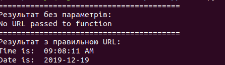
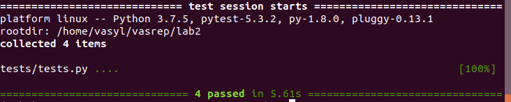
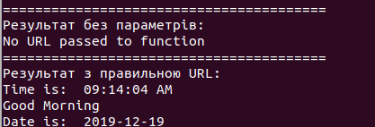

#### Lab2

1. Встановив pipenv на свою машину. Встановив python 3.7 та запустив оболочку за допомогою команди **pipenv shell**
2. Встановив бiблiотеки ntplib, requests та pytest.
3. Перевiрив програму на виконання, перевiрив тести на виконання.

4. Модифiкував функцiю що б показувала час дня та повiдомлення. Та написав тест для функцii.

5. Створив файл Makefile, заповнив його, виконав лабораторну.

