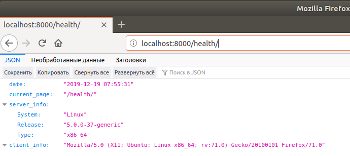

#### Lab4

1. Встановив докер та перевiрив його за допомогою команди, результат записав у файл.
2. Створив файл DockerFile та заповнив його пiд свiй репозиторiй.
3. Створив бiлд докер файлу, та запушив його не 
4. Запустив проект на виконання, перевiрив що вiн працюе.

5. Створив докер файл для монiторингу, запушив його на репозиторiй.
6. Скопiював файл server.log з репозиторiю, запушив його на репозиторiй гiт, виконав роботу.
