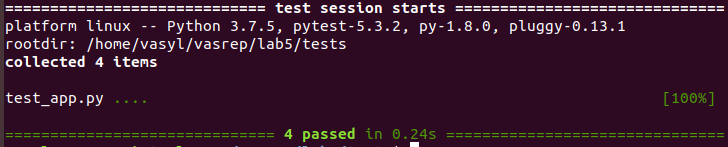
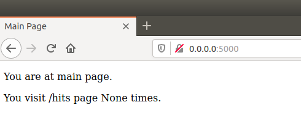
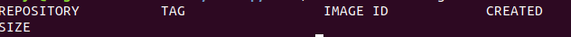

## Lab5

1. Створив папку my_app та скопiював файли з репозиторiю.
2. Встановив усi залежностi в requirements.txt, запустив проект. Деякi сторiнки не працювали, довелось робити виправлення. Пiсля манiпуляцiй - проект запустився успiшно i усi тести пройшли перевiрку

3. Збiлдив iмеджi для додатку та тестiв за допомогою sudo make app та sudo make tests.
4. Запустив проект на виконання за допомогою команди sudo make run.

5. Зупинив проект, запушив iмеджi на репозиторiй Докер. Видалив всi створенi iмеджi.

